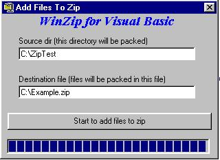



## Add files with Winzip , compression , extracting

### Description

Adding files to an archive using Winzip. but do not show winzip. Because it is running on the background. Users do not see winzip at all. Because i create a sort of Systemhook using API call. Were the power is
 
### More Info
 
One line of code - only the directory to add and the filename where the files will be added

Need to have Winzip installed (not tested it with the shareware version but working on).If the project don't run then try to install winzip in "C:\Program Files\Winzip\" and the executable should be "Winzip32.exe"

At this time of nothing but that is fixed in a couple of days and another few things.

NO SIDE EFFECT. because if you got side effect than you don't be good enough about programming

             |
---                |---
**Submitted On**   |2000-04-07 18:20:22
**By**             |[Michiel Schermer](https://github.com/Planet-Source-Code/PSCIndex/blob/master/ByAuthor/michiel-schermer.md)
**Level**          |Advanced
**User Rating**    |4.0 (48 globes from 12 users)
**Compatibility**  |VB 5\.0, VB 6\.0
**Category**       |[Complete Applications](https://github.com/Planet-Source-Code/PSCIndex/blob/master/ByCategory/complete-applications__1-27.md)
**World**          |[Visual Basic](https://github.com/Planet-Source-Code/PSCIndex/blob/master/ByWorld/visual-basic.md)
**Archive File**   |[CODE\_UPLOAD4606472000\.zip](https://github.com/Planet-Source-Code/michiel-schermer-add-files-with-winzip-compression-extracting__1-7094/archive/master.zip)

### API Declarations

A few. Find out yourself please. There are only 3 modules in it so it is not a lot of work

